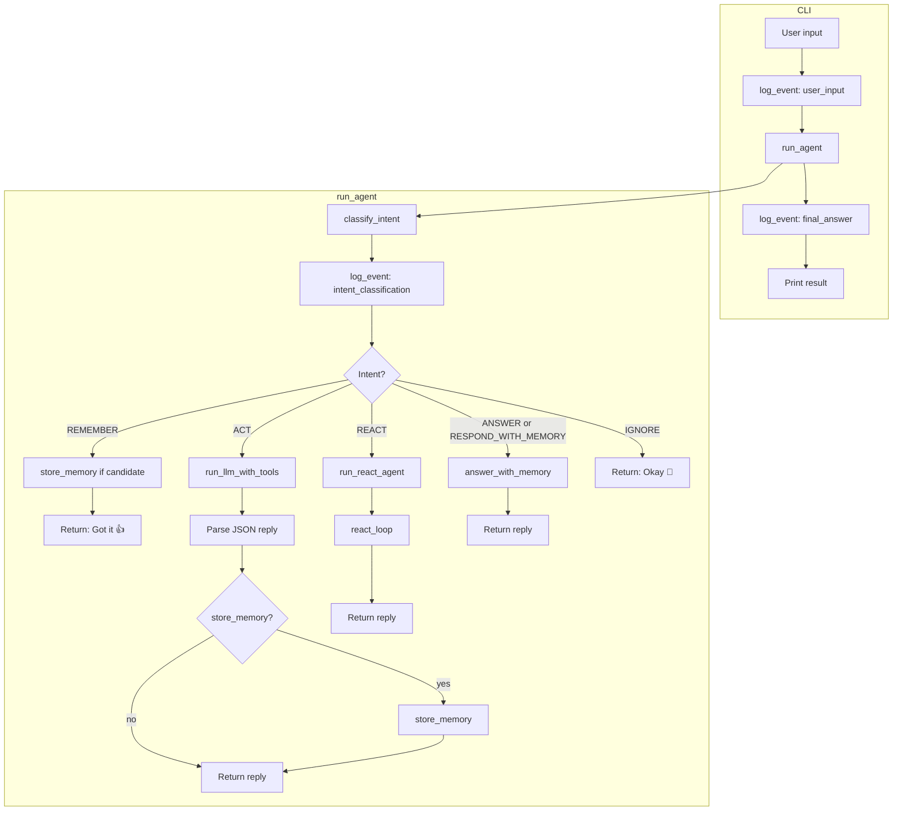
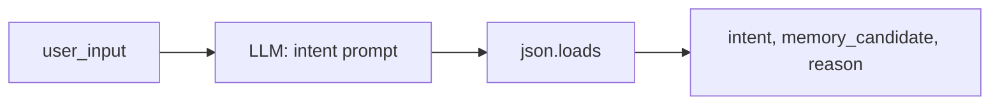
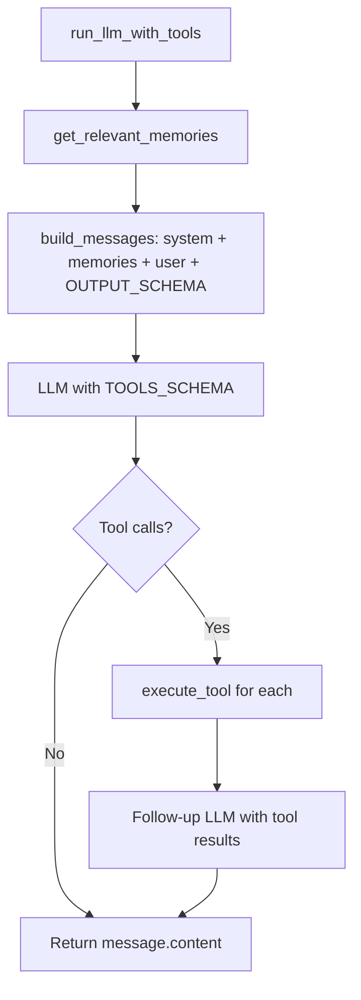
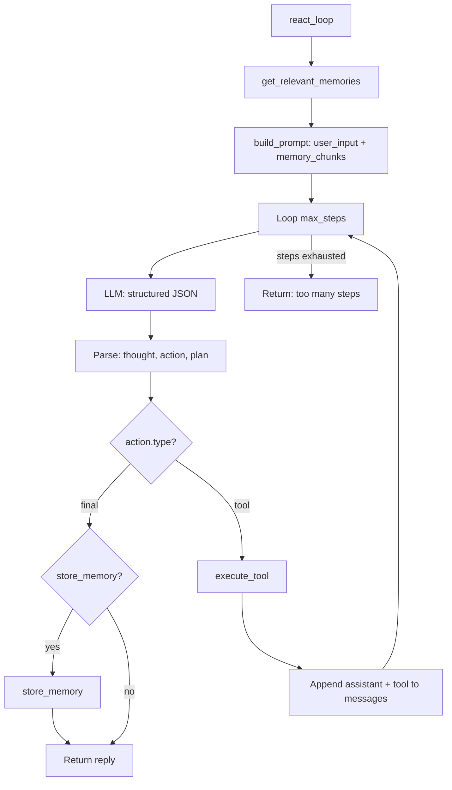
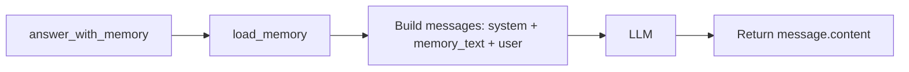

# Simple Agent – Flow

## High-level flow (Mermaid)

## Intent classification

## ACT path (single tool use)

## REACT path (multi-step loop)

## ANSWER / RESPOND_WITH_MEMORY path

## Data flow summary

| Path      | Memory read              | Memory write        | Tools        |
|-----------|--------------------------|---------------------|-------------|
| REMEMBER  | —                        | store_memory        | —           |
| ACT       | get_relevant_memories    | optional store      | calculator  |
| REACT     | get_relevant_memories    | optional store      | calculator  |
| ANSWER    | load_memory (full)       | —                   | —           |
| IGNORE    | —                        | —                   | —           |
